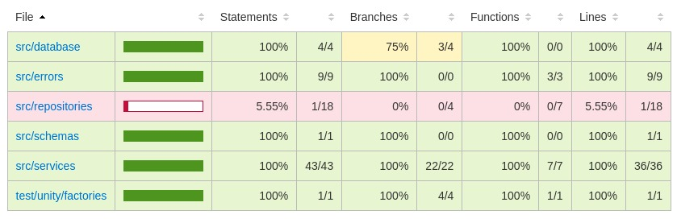

# Sing me a song API

<p align="center" >
    
</p>


  


## Cobertura de testes
<p align="center" >
    
</p>

## Descrição

Já pediu para alguém alguma recomendação de música? Foi para isso que construímos esta API.

Sing me a song é uma API para recomendação anômina de músicas. Quanto mais as pessoas curtirem uma recomendação, maior a chance dela ser recomendada para outras pessoas 🙂

A API possui as seguintes rotas:

<details>
    <summary><strong>POST</strong>  /recommendations</summary>
    
* Adiciona uma nova recomendação de música. A requisição deve ter o seguinte formato:
    
    ```json
    {
    	"name": "Falamansa - Xote dos Milagres",
    	"youtubeLink": "https://www.youtube.com/watch?v=chwyjJbcs1Y&ab_channel=Deck",
    }
    ```
    
    - Validação
        - `name` é uma string obrigatória
        - `youtubeLink` deve ser um link com domínio do youtube
    - Retorno
        - Retorna o objeto cadastrado no formato:
            ```json
            {
              "id": 5,
              "name": "Falamansa - Xote dos Milagres",
              "score": 0,
              "youtubeLink": "https://www.youtube.com/watch?v=ok-plXXHlWw"
            }
            ```
</details> 

<details>
    <summary><strong>POST</strong>  /recommendations/:id/upvote</summary>
    
- Adiciona um ponto à pontuação da recomendação. Não espera nada no corpo.
- Retorna o objeto com o score atualizado
</details> 

<details>
    <summary><strong>POST</strong> /recommendations/:id/downvote</summary>
    
- Remove um ponto da pontuação da recomendação. Não espera nada no corpo.
- Se a pontuação fica abaixo de -5, a recomendação será excluída.
- Retorna o objeto com o score atualizado
</details>

<details>
    <summary><strong>GET</strong> /recommendations/random</summary>
    
> Pega uma recomendação aleatória, baseada na seguinte lógica:

- **70% das vezes que baterem nessa rota**: uma música com pontuação maior que 10 será recomendada aleatoriamente;
- **30% das vezes que baterem nessa rota**: uma música com pontuação entre -5 e 10 (inclusive), deve ser recomendada aleatoriamente;
- Caso só haja músicas com pontuação acima de 10 ou somente abaixo/igual a 10, será sorteada qualquer música, independente de score;
- Caso não haja nenhuma música cadastrada, será retornado status 404;

- A resposta terá o formato:

        {
          "id": 5,
          "name": "Falamansa - Xote dos Milagres",
          "score": 42,
          "youtubeLink": "https://www.youtube.com/watch?v=ok-plXXHlWw"
        }
</details>


<details>
    <summary><strong>GET</strong> /recommendations/top/:amount</summary>
    
> Lista as músicas com maior número de pontos e sua pontuação. Retorna as top x músicas (parâmetro `:amount` da rota), ordenadas por pontuação
(maiores   primeiro)
    
            [
                {
                    "id": 150,
                    "name": "Chitãozinho E Xororó - Evidências",
                    "youtubeLink": "https://www.youtube.com/watch?v=ePjtnSPFWK8&ab_channel=CHXVEVO",
                    "score": 245
                },
                {
                    "id": 12,
                    "name": "Falamansa - Xote dos Milagres",
                    "youtubeLink": "https://www.youtube.com/watch?v=ePjtnSPFWK8&ab_channel=CHXVEVO",
                    "score": 112
                },
                ...
            ]
</details>
